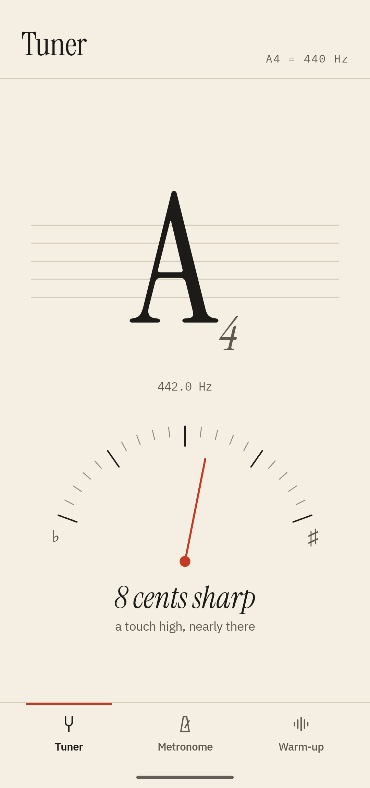
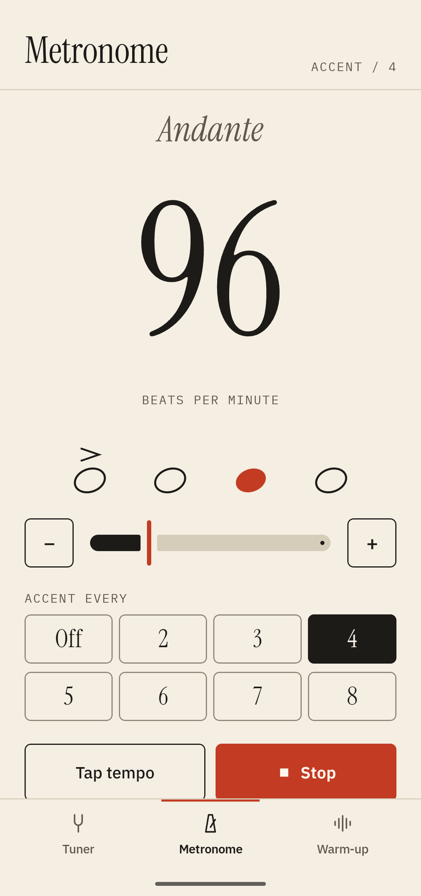
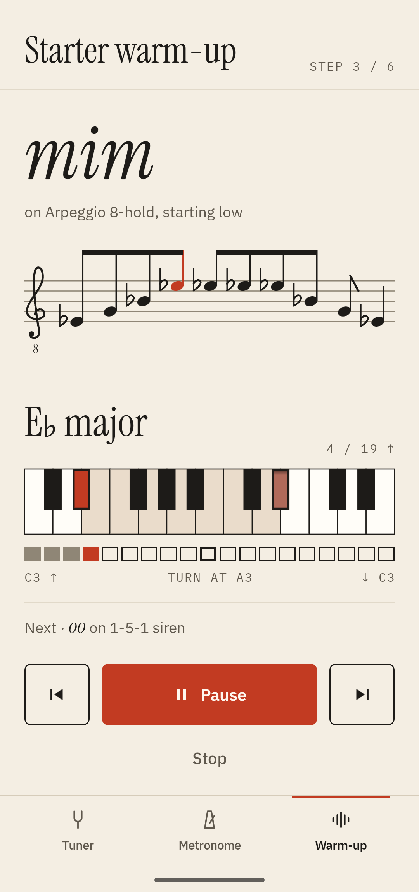
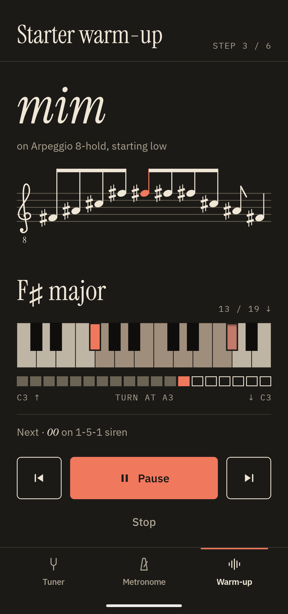
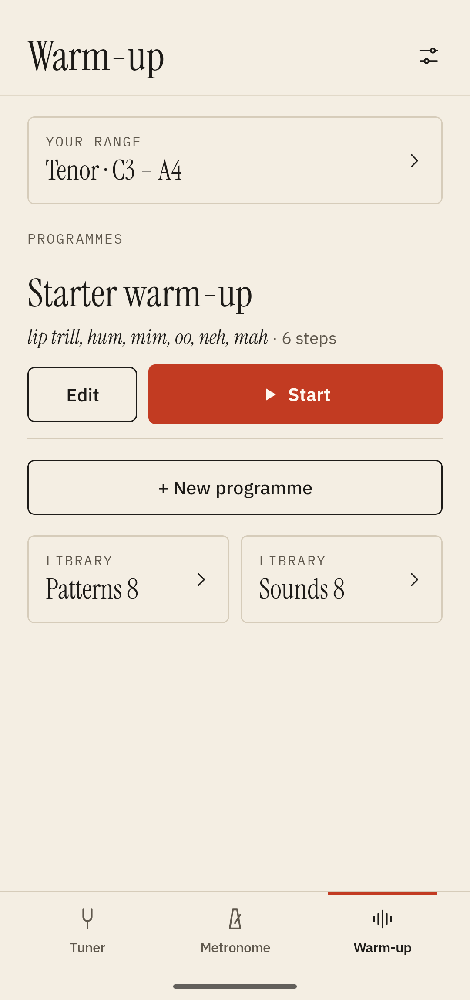
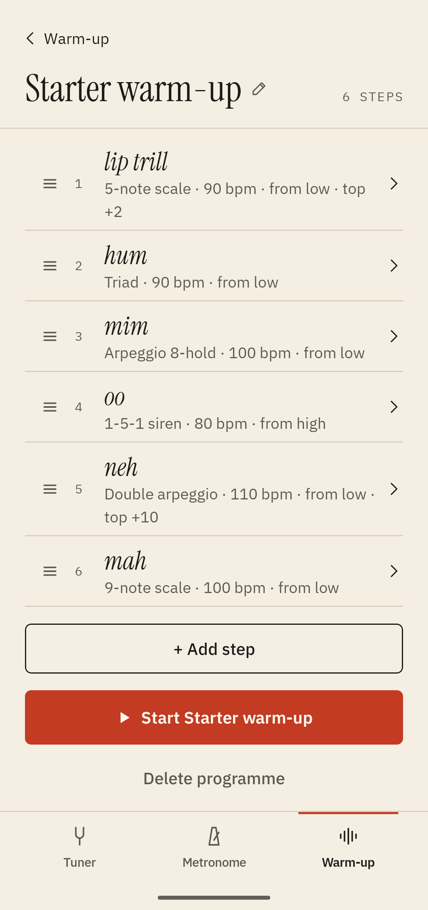
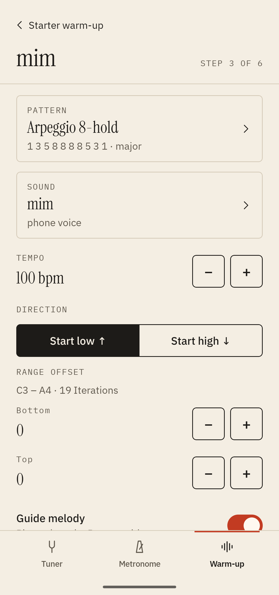
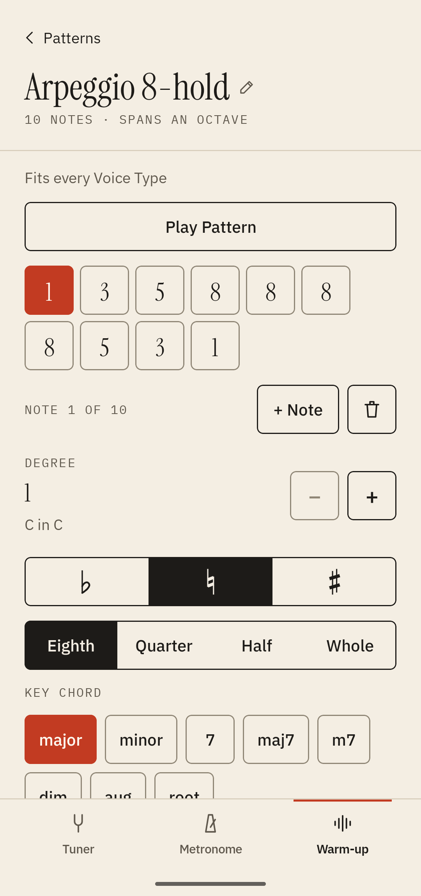
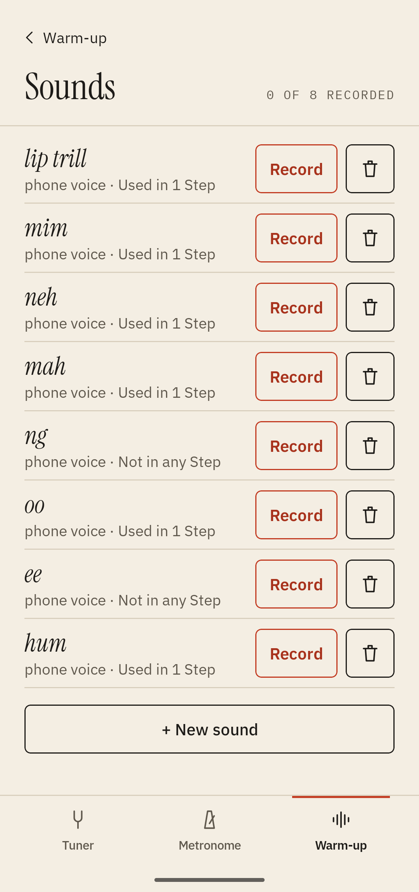
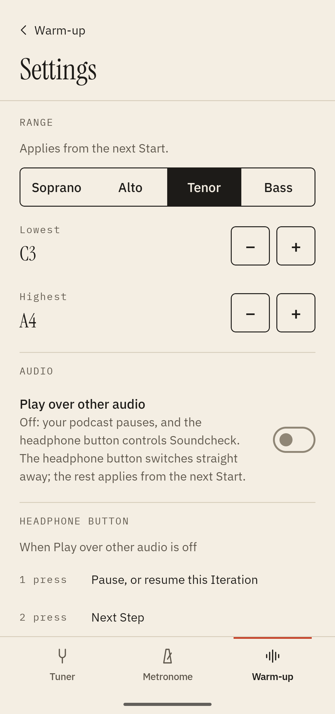

# Soundcheck

A vocal warm-up that runs hands-free on a sampled grand piano, with a Tuner and a
Metronome, for Android.

[**Download Soundcheck 1.0.0 (APK)**](https://github.com/pashri/soundcheck/releases/latest)
· Android 11 or later · free and open source ([MIT](LICENSE)), with no ads or accounts

## Screenshots

<p align="center">
  
  
  
  
</p>
<p align="center">
  
  
  
</p>
<p align="center">
  
  
  
</p>

## About

Press Start and put the phone in your pocket. Soundcheck plays each exercise on the piano,
says what to sing, and takes you up through the keys to the top of your range, then back
down. The headphone button pauses, skips and goes back, so you can warm up in the car
without touching the phone.

You write the exercises yourself or start from the six that come with it, set your range
from a voice type, and record each sound's spoken cue in your own voice. If you
do look at the screen, the exercise is on a staff in the clef for your voice, and a keyboard
below it shows the note you're singing.

## Features

### The Warm-up

A Programme is a list of Steps. Each Step sings one Pattern (the notes) on one Sound (a lip
trill, a hum, "mah") at its own tempo.

Every Step starts with a spoken cue and a demo of the Pattern. Then the piano plays the key
chord and you sing. Up a half-step, again and again, until the Pattern reaches the top of
your range; then it takes you back down to where you started. Steps that can't fit your
range are skipped, and the editors warn you about them first.

The piano is the Salamander Grand. It was recorded on every third key, and Soundcheck
re-pitches the nearest recording for the keys in between, scheduling each note to the exact
sample so it lands on the beat. The piano can play the melody with you, or leave you alone
over the chords. Steps can start low or high.

### Hands-free

It keeps playing with the screen off, in your pocket or over the car's Bluetooth. On the
headphone button, one press pauses or resumes, two skip to the next Step, three go back one,
and the same button starts and stops the Metronome. The lock screen has pause, next and
stop. Pulling out your headphones pauses it, and so does a phone call; when the call ends,
Soundcheck carries on. To keep a podcast playing underneath, turn on *Play over other audio*.

### The staff and keyboard

The exercise is drawn on a staff in the clef for your voice: treble for soprano and alto,
treble with an 8 below for tenor, bass for bass. Notes are spelled for the key, with ledger
lines, sharps and flats. A vermilion note follows the piano, and the staff stays put as the
keys change.

The keyboard underneath marks the Step's key and its top note, and the key you're singing
right now looks pressed down.

### Your own exercises

Pick Soprano, Alto, Tenor or Bass. Then move the lowest and highest notes to suit your voice
that day.

Patterns are written as scale degrees, which can go past the octave, with sharps and flats,
four note lengths, and a key chord such as major, minor or a seventh. Tap Play to hear one.
A Step sets the Pattern, the Sound, the tempo, the direction and how far to shift the range,
and "Hear the Demo" plays it in its first key.

Each Sound's spoken cue can be your own recording. Hold to record, and the silence at each
end is trimmed off; you can re-record or undo, and until you record one the phone's voice
reads the name.

A six-Step starter Programme comes with it, from lip trills through hums to open vowels.

### Metronome and Tuner

The Metronome's tempo is set with − and +, a slider, or by tapping it out, with an accent
every 2 to 8 beats or none. It keeps time to the sample. It also keeps going with the screen
off, and the headphone button starts and stops it.

The Tuner shows the note you play or sing, its octave, and how many cents sharp or flat you
are, on a dial and a small staff. It only listens while it's open, and it doesn't keep what
it hears.

### Night mode and accessibility

The app is warm paper by day and dark ink at night, following your phone's dark theme. It
works at the largest text and display sizes, and TalkBack reads every control, including
sharps, flats and the notes on the staff.

### Privacy and backups

Everything stays on your phone. There are no accounts, ads or analytics, and the app doesn't
ask for internet access. You can back up your library and settings to one small file, on
Drive or in Downloads, and restore it later or on a new phone. Recordings aren't included
in the backup.

## Download and install

Soundcheck isn't on the Play Store. You install the APK from this page yourself, which
Android calls sideloading.

1. On your phone, open the
   [latest release](https://github.com/pashri/soundcheck/releases/latest) and tap
   `soundcheck-1.0.0.apk` under *Assets* to download it. You need Android 11 or later.
2. Open the downloaded file, from the download notification or from *Downloads* in the
   *Files* app.
3. The first time, Android says your browser or file manager isn't allowed to install
   unknown apps. Tap *Settings*, turn on *Allow from this source*, and go back.
4. Tap *Install*, then *Open*. When it asks to show notifications, allow it, or the
   lock-screen controls won't appear.

From a computer with USB debugging on, `adb install soundcheck-1.0.0.apk` does the same.

To update, install the newer APK the same way. It replaces the old one and keeps your
library and recordings, because every release is signed with the same key.

To check the download, compare its SHA-256 with the one in the release notes. The signing
certificate's SHA-256 is
`e5344cc15ea8190e23d5dd6380798a96d56e284781ff29f7054fbffb426bf5ef`.

To remove it, long-press the icon and choose *Uninstall*. That deletes your library, so back
it up first if you might want it again.

---

The rest of this page is for people building Soundcheck from source.

## How it's built

- Kotlin and Jetpack Compose, one activity, one `:app` module.
- All sound goes through a small C++ mixer on Google's Oboe library, scheduled to the exact
  sample, so the Metronome never drifts or stutters and every piano note lands on its beat.
  The piano is recorded every third key; the mixer re-pitches the nearest recording for the
  keys in between.
- The Tuner listens through Android's `AudioRecord`, not the mixer, and finds the pitch in
  Kotlin with the McLeod Pitch Method. It listens only while its tab is open, and nothing
  it hears is recorded or kept. When another app takes the microphone (a call, a voice
  recorder), Android feeds the Tuner silence; the Tuner notices within half a second, says
  so, and listens again once the other app lets go.
- The Warm-up's playing screen draws the Pattern on a staff at its real pitches in each
  Iteration's key, in the clef your Range reads (treble, treble an octave lower for a
  tenor's Range, or bass), with the note being sung in vermilion, and your Range as a
  keyboard with the Iteration's key and the Pattern's top note marked.
  If the sound output fails, or another app is holding on to the sound, a paused Programme
  says so rather than looking like an ordinary pause.
- On the Sounds screen you hold a button and say a Sound; Soundcheck drops the press and
  the release, trims the silence from both ends, evens out the level and keeps up to 5
  seconds of it as a small 16-bit mono WAV file in the app's private storage, with a
  one-step Undo for a new take and "Use phone voice" to go back to text-to-speech. The
  Tuner and the recorder share the microphone and never have it open at the same time;
  each retries for about 400 ms rather than reporting the microphone unavailable while the
  other lets go of it. A Sound you haven't recorded is read by the phone's text-to-speech.
  A recording that no Sound in the library names any more is deleted the next time the app
  starts, unless a `library.json.backup-*` copy an import kept, or a
  `library.json.unreadable-*` copy set aside because it couldn't be read, still names it.
- The Warm-up runs in a foreground service whose notification carries Soundcheck's one
  media session: the lock screen shows pause, next and stop, and the headphone button
  pauses (one press), skips to the next exercise (two) and goes back (three). The
  Metronome uses the same service, so it keeps clicking with the screen off, in the
  background or on another tab; while it plays on its own the notification shows its
  tempo and accent with Pause and Close, and tapping it opens the Metronome. While a
  Programme is loaded the Warm-up's notification comes first. Off screen, a headphone
  press or Pause pauses the Metronome and the notification stays, with Play; another press
  or Play starts it again. Unplugging headphones pauses it too, as it does a Programme.
  It ends when you press Stop on its screen (or the headphone button while the screen
  shows), press Close, another tool starts (the Tuner listening, a Programme, a Demo), or
  another app takes audio focus for good. Only one tool plays, records or listens at a
  time.
- The Warm-up's library (Patterns, Sounds and Programmes) and its settings are two small
  JSON files in the app's private storage, rewritten whole, atomically, on every change. A
  fresh install starts with eight Patterns, eight Sounds and a sample Programme. Nothing
  leaves the phone unless you export it: there are no accounts and no sync.
- Settings → Backup exports the library and settings as one JSON file through Android's
  file picker (to Drive, Downloads or anywhere else), and imports one back. An import
  replaces the library and settings after asking, keeps the old files on the phone as
  timestamped backups, and leaves your recordings where they are, matched to Sounds by id
  — recordings named by those backups stay on the phone until the backups are deleted.
  Recordings are never exported. An export that fails part-way removes the file it
  started only if the file was empty before; any other file is left as it is.
- With "Play over other audio" on, the Warm-up and the Metronome play under a podcast
  instead of pausing it, and the headphone button stays with the podcast app: Soundcheck
  then has no media session at all, only its notification (pause, next and stop for the
  Warm-up, Pause or Play and Close for the Metronome). Some Bluetooth headsets only send
  "pause" while any audio is still playing, so they can pause the other app but not resume
  it. Recording always pauses a podcast, so it isn't recorded under your voice. While the
  Metronome's tab is open, or while it plays or is paused (screen off included), one press
  of the headphone button starts or stops it; the button goes to whichever of the
  Metronome and the Warm-up you started last, through Soundcheck's one media session. The
  press only reaches Soundcheck if it was the last app to play sound; otherwise Android
  sends it to that app.
- The Step and Pattern editors can play a Step's Demo or a Pattern on the piano, using the
  same timeline as the Warm-up, and the Sounds screen plays your recordings; doing either
  pauses a playing Programme.
- The look is the Manuscript design: paper, ink and vermilion by day, dark ink, cream and a
  lighter vermilion by night, following the phone's dark theme, down to the dialogs, the
  menus and the launch screen. The icon is a waveform standing on a staff, with a
  single-colour layer for Android's themed icons.

## Building

Needs JDK 17 and the Android SDK with platform 35, NDK 28.2.13676358 and CMake 3.22.1:

```bash
~/Library/Android/sdk/cmdline-tools/latest/bin/sdkmanager "ndk;28.2.13676358" "cmake;3.22.1"
```

```bash
./gradlew :app:testDebugUnitTest   # Kotlin tests
tools/run-native-tests.sh          # C++ engine tests, on this Mac
./gradlew :app:installDebug        # install a debug build on a connected phone
```

A debug build installs as "Soundcheck debug" (`org.pashri.soundcheck.debug`), beside the
release, with its own data.

A debug build can feed the Tuner a steady synthetic tone instead of the microphone, which
is handy on the emulator (its microphone can hang it) and for screenshots. Release builds
don't contain this:

```bash
adb shell am start -n org.pashri.soundcheck.debug/org.pashri.soundcheck.MainActivity \
    --ef demoTuneHz 442.04   # the Tuner reads A4, 8 cents sharp
```

The piano samples are committed under `app/src/main/assets/piano/`.
`tools/fetch-piano-samples.sh` rebuilds them from the original archive; it needs `ffmpeg`
and downloads 742 MB.

## Release build

The release is a signed APK you install yourself; it isn't on the Play Store. Its key never
goes in this repository.

1. Once, make the key and keep a copy of it and its password somewhere safe (a password
   manager): without them, no later release can install over this one.

   ```bash
   keytool -genkeypair -v -keystore ~/.android/soundcheck-release.jks \
       -alias soundcheck -keyalg RSA -keysize 4096 -validity 10000
   ```

   `keytool` asks for the password and your name; type them at its prompts rather than on
   the command line. It makes a PKCS12 keystore, whose key password is the store password.

2. Tell the build where it is, in `keystore.properties` in the project root, which
   `.gitignore` keeps out of the repository:

   ```properties
   # Soundcheck's release signing key. This file is never committed.
   # Back up ~/.android/soundcheck-release.jks and its password: without them no later
   # release can install over this one.
   storeFile=/Users/<you>/.android/soundcheck-release.jks
   storePassword=…
   keyAlias=soundcheck
   keyPassword=…
   ```

   A path starting with `~/` works too.

3. Build and install it:

   ```bash
   ./gradlew :app:assembleRelease
   adb install -r app/build/outputs/apk/release/app-release.apk
   ```

A release build without `keystore.properties` stops before packaging and says what is
missing; it never produces an unsigned APK. Debug builds, and running the unit tests,
don't need the file.
`./gradlew :app:assembleRelease -Psoundcheck.signWithDebugKey=true` signs it with this
computer's debug key instead, prints a warning, and gives it versionName
`1.0.0-debugkey`, for trying the minified build on an emulator; that APK is for testing
only.

## Licence

Soundcheck's code is released under the [MIT License](LICENSE). The fonts and piano samples
it bundles keep their own licences, listed below.

## Credits

Instrument Serif, IBM Plex Sans and IBM Plex Mono are used under the SIL Open Font License.

Audio runs through Google's [Oboe](https://github.com/google/oboe) library, used under the
Apache License 2.0.

The piano is the [Salamander Grand Piano V3](https://freepats.zenvoid.org/Piano/acoustic-grand-piano.html)
by Alexander Holm, used under the
[Creative Commons Attribution 3.0](https://creativecommons.org/licenses/by/3.0/) licence.
Each sample was mixed to mono and shortened to 4.5 seconds, and Soundcheck retunes the keys
as it plays them. The per-key tuning comes from the "Retuned" SFZ mapping by Markus Fiedler.
